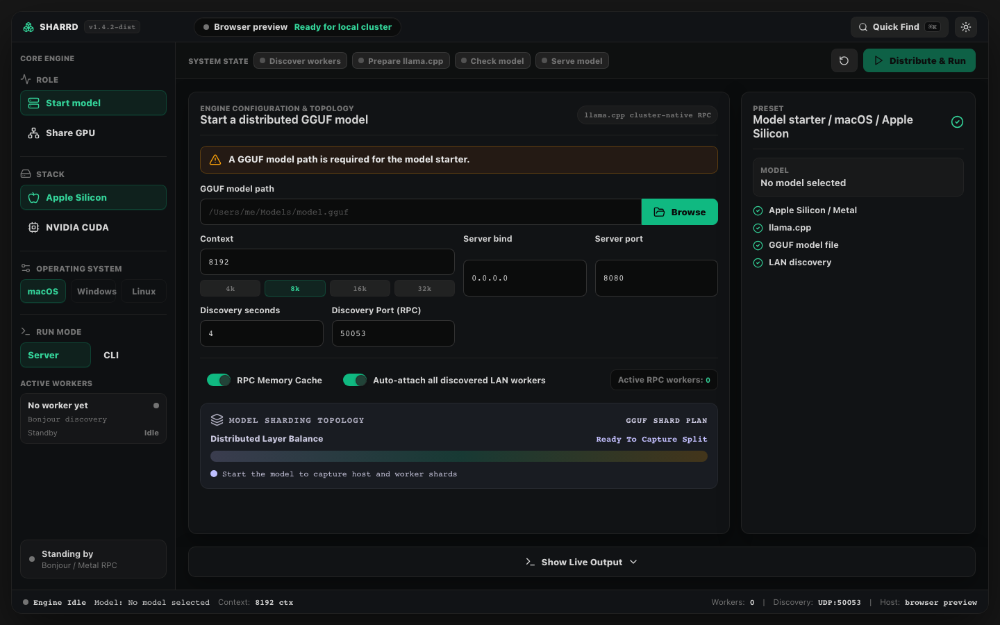

# Sharrd

Desktop launcher for running large GGUF models with llama.cpp RPC sharding.



## What it wraps

- Start a distributed model from the main machine.
- Share the local GPU as an RPC worker.
- Apple Silicon/macOS uses Metal and Bonjour discovery.
- NVIDIA/Windows uses CUDA, Git Bash, PowerShell discovery, and LocalSubnet firewall rules.
- NVIDIA/Linux uses CUDA, bash, Python UDP discovery, and llama.cpp RPC.

The six platform scripts are the complete command-line workflow:

- `start-distributed-model-windows-nvidia.sh` and `share-gpu-worker-windows-nvidia.sh` for NVIDIA/Windows Git Bash.
- `start-distributed-model-macos-apple-silicon.sh` and `share-gpu-worker-macos-apple-silicon.sh` for Apple Silicon/macOS.
- `start-distributed-model-linux-nvidia.sh` and `share-gpu-worker-linux-nvidia.sh` for NVIDIA/Linux.

Run the matching `share-gpu-worker-*.sh` script on each machine contributing a GPU, then run the matching `start-distributed-model-*.sh` script on the machine hosting the model. On macOS, add `BACKGROUND=1` to run the share worker without keeping the terminal open; its log path is printed at startup.

For workers on another routed subnet, enter comma-separated IPv4 `/23` or `/24` networks in the app's **Remote worker subnet(s)** field. The value is saved locally and used by every host platform for directed UDP discovery. On a Windows worker, enter the host's subnet in **Allowed host subnet(s)** so the generated firewall rules admit discovery and RPC only from that network.
## Run in development

```bash
npm install
npm run tauri:dev
```

## Build a desktop package

```bash
npm run tauri:build
```

macOS release builds are configured for Developer ID signing with hardened runtime. To notarize the DMG so it opens cleanly on other Macs, build with Apple notarization credentials in the environment:

```bash
APPLE_ID="you@example.com" \
APPLE_PASSWORD="app-specific-password" \
APPLE_TEAM_ID="your-team-id" \
npm run tauri:build
```

Or use App Store Connect API key notarization by setting `APPLE_API_KEY`, `APPLE_API_ISSUER`, and `APPLE_API_KEY_PATH` before running the build.

For a faster unsigned local package while developing:

```bash
npm run tauri -- build --debug
```

The app embeds the shell workflows at compile time, so packaged builds do not need the original `.sh` files beside the executable.
